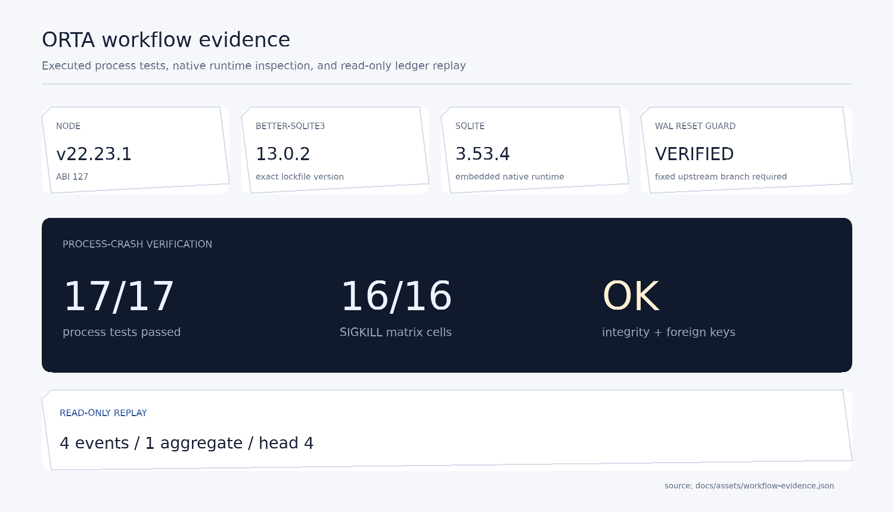
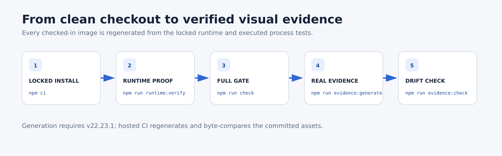
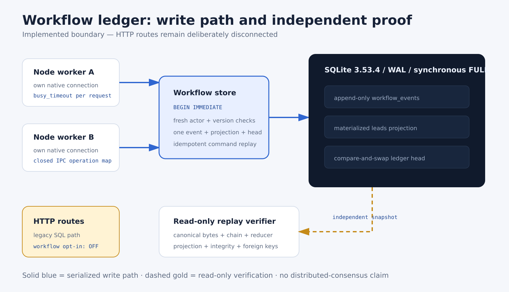
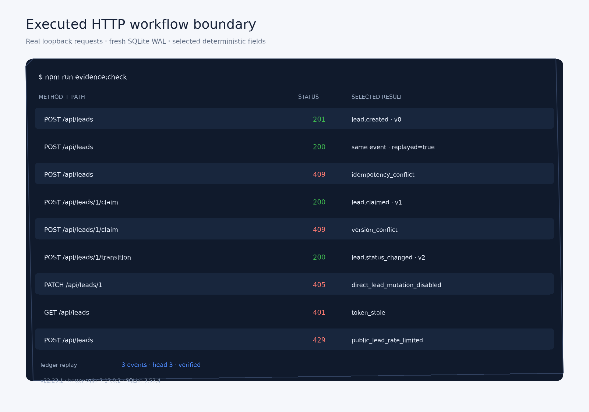
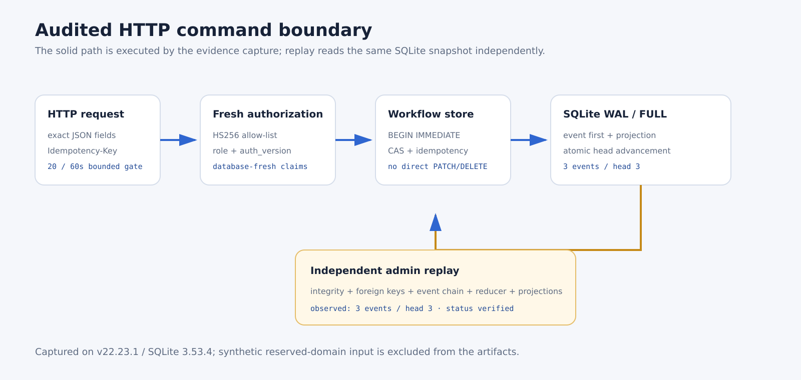
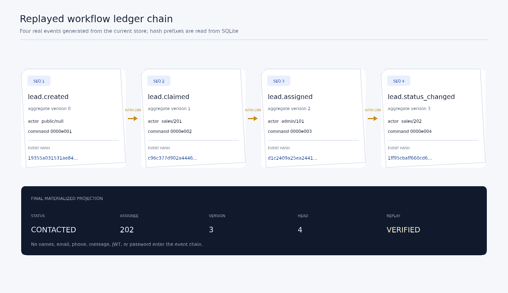
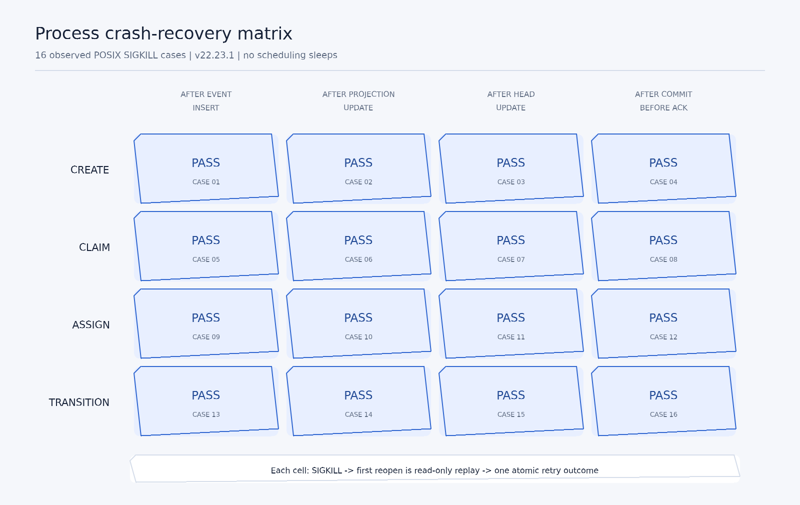
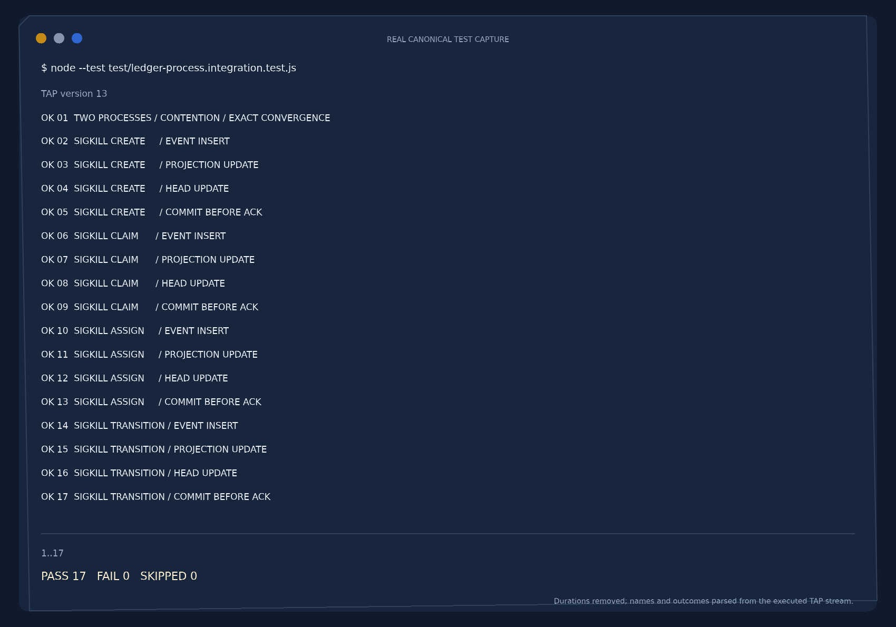
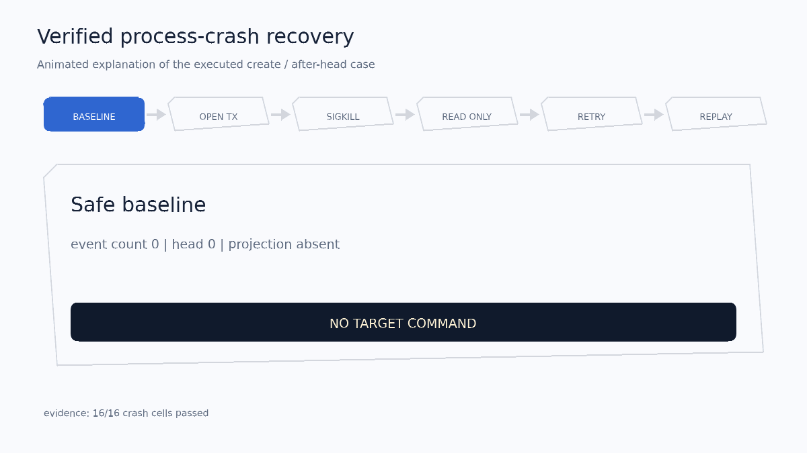

# ORTA Study API

ORTA Study API is a small local Express and SQLite prototype for user, lead,
and chat workflows. The chat route currently returns deterministic,
keyword-based responses; it does not call an external AI provider.



The scorecard above is generated from the loaded native runtime, an executed
17-test process suite, and an independently replayed SQLite ledger. Its
[machine-readable source and regeneration contract](docs/visual-evidence.md)
are committed beside the image.

This repository is an early backend prototype, not a production service. The
current security boundary is intentionally strict:

- no user is created automatically;
- demo users require an exact opt-in flag and two externally supplied,
  distinct passwords;
- demo identities use reserved `example.com` addresses and no phone numbers;
- `JWT_SECRET` has no fallback and must contain at least 32 non-whitespace
  characters;
- runtime databases, SQLite sidecars, dependencies, and local environment
  files are ignored by Git.

## Local setup



Requirements:

- Node.js 22 or 24;
- a bundled `better-sqlite3` N-API target: Linux (glibc or musl), macOS, or
  Windows on x64 or arm64.

Install the exact locked dependencies:

```bash
npm ci
```

Project npm configuration disables dependency install scripts. The pinned
`better-sqlite3` release includes its reviewed N-API binaries, so supported
platforms do not need a download or native compilation hook during install.
Any future dependency that requires an install script must be reviewed and
enabled deliberately rather than executing implicitly.

Create a local configuration file:

```bash
cp .env.example .env
node -e 'console.log(require("node:crypto").randomBytes(32).toString("hex"))'
```

Copy the generated value into the ignored `.env` file as `JWT_SECRET`. Do not
commit that value. The default database path in `.env.example` is local and
ignored.

Start the API:

```bash
npm start
```

Startup fails before a database file is opened or the server begins listening
if `JWT_SECRET` is missing or too short. Invalid demo-seed configuration also
fails before a database file is opened.

## Audited HTTP and integrity design

The application now routes every lead mutation through the transactional
workflow store. Public creation requires a bounded Idempotency-Key, operator
commands use explicit claim, assign, and transition endpoints, and legacy
PATCH or DELETE mutation is rejected. Signed tokens are accepted only with
HS256 and only while their email, role, and auth_version still match a fresh
database row.

The byte-level ledger contract remains deliberately free of direct contact
content: bounded canonical JSON, domain-separated command and event hashes,
database-fresh actor and assignment checks, version compare-and-swap, guarded
append-only history, and complete chain plus projection verification. Read the
[event contract](docs/workflow-ledger-contract.md),
[storage design](docs/workflow-storage.md),
[replay design](docs/workflow-replay.md), and
[multi-process evidence](docs/workflow-concurrency.md) for exact guarantees and
non-claims.

The enabled boundary fails closed on SQLite runtimes affected by the WAL-reset
corruption defect. The pinned driver embeds SQLite 3.53.4; startup and writer
construction independently require a fixed runtime before workflow state is
touched.



The solid path is the implemented command boundary. Public requests first pass
the bounded in-process rate gate; authenticated requests additionally require
a database-fresh JWT. Every accepted mutation then enters one BEGIN IMMEDIATE
transaction that appends an event, updates the projection, and advances the
ledger head.



This terminal capture comes from a fresh loopback Express server and SQLite WAL
database. It records selected deterministic fields from real requests: exact
replay, changed-body conflict, version conflict, stale-token rejection,
direct-mutation rejection, and rate limiting. Tokens, contact fields, ports,
timestamps, and raw bodies are excluded.

A minimal command sequence is:

~~~bash
curl -X POST http://127.0.0.1:5000/api/leads   -H "Content-Type: application/json"   -H "Idempotency-Key: cmd_00000000000000000000000000000001"   --data-binary @synthetic-lead.json

curl -X POST http://127.0.0.1:5000/api/leads/1/claim   -H "Authorization: Bearer $TOKEN"   -H "Content-Type: application/json"   -H "Idempotency-Key: cmd_00000000000000000000000000000002"   --data-binary "{\"expected_version\":0}"

curl http://127.0.0.1:5000/api/leads/_workflow/replay   -H "Authorization: Bearer $ADMIN_TOKEN"
~~~



The admin replay endpoint is read-only. It checks SQLite integrity, foreign
keys, canonical events, the global hash chain, reducer state, projections, and
the ledger head in one snapshot; it does not repair state.



The event hashes, actors, versions, final projection, and head in this figure
come from a freshly executed workflow. Direct contact fields never enter the
ledger evidence.

## Explicit synthetic demo users

Demo accounts are off by default. To create the two reserved-domain identities
in a disposable local database, provide both passwords through the process
environment:

```bash
export ORTA_SEED_DEMO_USERS=true
read -rsp 'Synthetic admin password: ' ORTA_DEMO_ADMIN_PASSWORD
export ORTA_DEMO_ADMIN_PASSWORD
read -rsp 'Synthetic sales password: ' ORTA_DEMO_SALES_PASSWORD
export ORTA_DEMO_SALES_PASSWORD
npm start
```

Each password must contain at least 12 non-whitespace characters, and the two
values must be different. Passwords are hashed before insertion and are never
logged. Repeated startup is idempotent: existing synthetic identities are not
overwritten.

## Verification

Run the offline syntax and test suite:

```bash
npm run check
```

The check begins by printing machine-readable evidence for the actual Node,
native ABI, `better-sqlite3`, and SQLite versions it loaded, including the
WAL-reset safety decision. GitHub Actions performs a clean locked install and
runs the same gate on Node.js 22 and 24; a separate job audits production
dependencies. Workflow actions are pinned to reviewed immutable commit SHAs,
credentials are not persisted after checkout, and every job has read-only
repository permissions.

Configuration tests use only Node's built-in test runner. Database integration
tests use a fresh directory under the operating system's temporary directory
and remove it afterward. They skip cleanly when the application dependencies
have not yet been installed; after `npm install`, they exercise schema
initialization, opt-in seeding, idempotence, and fail-before-open behavior
without a network call. The workflow contract tests additionally lock canonical
bytes, golden hashes, command/event correlation, actor policy, transition
policy, and hostile JavaScript object rejection.

Storage integration tests additionally exercise WAL/FULL configuration,
idempotent create and operator commands, fresh roles and auth versions, guarded
head/event updates, all-or-nothing legacy migration, and rollback at each write
boundary.

Replay integration tests independently rebuild every aggregate from an idle,
read-only SQLite snapshot, compare workflow projections and ledger anchors,
exercise UTF-8/UTF-16 storage and the legacy timestamp boundary, bound hostile
copied values before driver transfer, and reject chain, event, projection, and
database-integrity corruption without exposing contact content.

HTTP integration starts the real Express app on loopback with a fresh database,
issues public and authenticated requests, checks status and failure mappings,
proves contact-free public receipts, invalidates an auth version, exercises the
20-request public window, and invokes independent admin replay. The complete
hosted suite currently contains 75 passing tests on both Node.js lines.

Process integration tests run two independent Node.js workers against one WAL
file, coordinate real in-transaction contention without scheduling sleeps, and
verify exact chain/projection convergence. A 16-cell `SIGKILL` matrix covers
create, claim, assign, and transition at all three write checkpoints plus the
post-commit/pre-ack window. Each crash is first inspected through read-only
replay; retries prove either one fresh commit or one idempotent replay.





The matrix is a categorical proof grid rather than a performance heatmap: every
cell is one observed crash case, and `PASS` is printed so the result does not
depend on color. The terminal capture preserves executed test names and counts
while omitting nondeterministic durations.



The animation explains one verified rollback/retry path; it is not presented
as a recording. Run `npm run evidence:generate` to rebuild every asset and
`npm run evidence:check` to execute the source evidence again and byte-compare
the committed outputs.

## Data and history boundary

The runtime SQLite snapshot formerly tracked by the repository is removed from
the current tip. That deletion does **not** erase prior Git history. Repository
owners should separately review historical data exposure and rotate any
credentials that may ever have been committed. This hygiene change does not
rewrite history and makes no claim that historical objects were purged.

## Known limitations

- The public rate limiter is bounded and fail-closed within one process, but it
  is neither distributed nor durable across restarts.
- SQLite storage is local and is not encrypted at rest by this application.
- The AI route is an explicitly labelled keyword-based placeholder, not an LLM.
- Default CORS behavior and the remaining user/chat request surfaces require a
  deployment-specific hardening pass before internet exposure.
- Replay proves internal consistency of one supplied snapshot; an
  attacker-controlled rewrite of the entire unsigned local chain is outside
  its trust claim.
